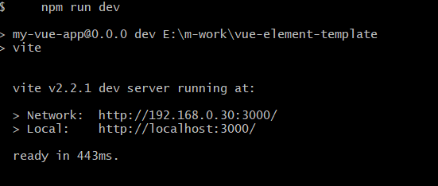
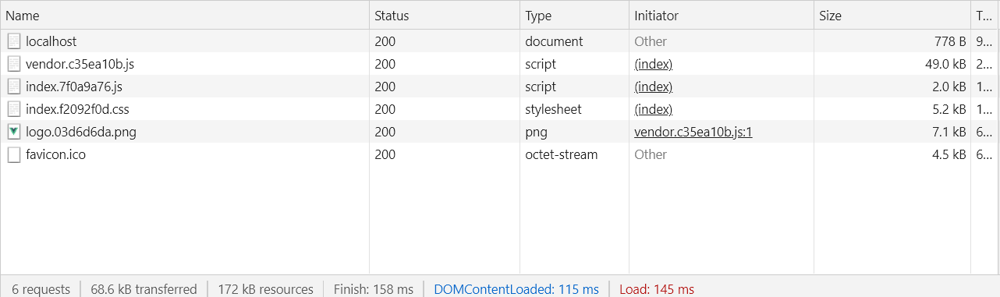

# vue-element-template
> 这是一个简单的后端管理模板。它使用 vite 快速编译(启动<1s),使用eslint prettier lint commitlint 统一代码格式,使用 vue vuex vue-router axios mock 搭建基础功能。

## Build step
```
# clone
git clone https://github.com/mikepxq/vue-element-template.git

# 进入项目目录
cd vue-element-template

# 安装依赖
npm install

# 启动
npm run dev

# 生成模式
npm run build
```
## 其他

```
# 预览
npm run preview 

# 代码格式化及自动修复
npm run lint:fix
```
## Demo
###### 1.启动时间
<!-- 临时地址 -->

###### 2.element-plus 按需引入 el-button 组件，首页加载大小。

## [commitlint](https://github.com/conventional-changelog/commitlint) 常见类型
```
  build
  ci
  chore
  docs
  feat
  fix
  perf
  refactor
  revert
  style
  test
  # demo
  feat: 统一开发环境 eslint prettier scss
```
## 技术说明
> 为什么单独样式文件
```
  1.为了后期皮肤等业务扩展，虽说不一定用的到，但好的架构还是需要的。
  2.减少.vue 文件维护压力。

```
> css class 命名规则

```
  1.通用类，准守 EBM 规范
  2.与业务相关的类，以下划线为间隔（业务_业务_业务_）。可以理解为命名空间。
```
## jsx
> 遇到的兼容性问题
```
1.typescript 语法下 eslint parser 配置为 vue-eslint-parser 时,未使用变量没提示错误。
2.vue 原生组件 Transition 配合 Component  无效
```
## Browsers support

Modern browsers 

| [](http://godban.github.io/browsers-support-badges/)</br> Edge Chrome版 | [](http://godban.github.io/browsers-support-badges/)</br>Chrome |
| --------- | --------- | 
| last 2 versions| last 2 versions

<!--  [](http://godban.github.io/browsers-support-badges/)</br>Safari | [](http://godban.github.io/browsers-support-badges/)</br>Firefox | -->
## License
[MIT](./LICENSE) license.

Copyright (c) 2021-present mikepxq